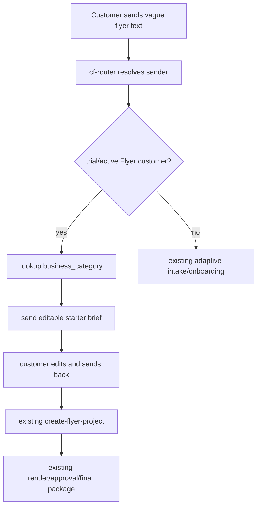

# Flyer Business Starter Briefs Design

**Drift-check tag:** extends-Hermes

**New primitives introduced:** `agents.flyer.starter_briefs`, a category starter-brief reply for Flyer onboarding/intake, and a `cf-router` guard for active/trial vague starts.

## Hermes-First Analysis

| Domain | Hermes skill found? | Decision |
|---|---|---|
| WhatsApp intake/routing | yes - existing `dispatch_shift_agent`, `flyer_generation`, and live `cf-router` | use it |
| Image/flyer generation | yes - existing Flyer Studio renderer plus Hermes creative/image skills at https://hermes-agent.nousresearch.com/docs/skills | use existing Flyer Studio path |
| Business-specific starter brief catalog | none found in live skills/plugins or Hermes Skills Hub | build small catalog from scratch |
| External template storage | yes - Airtable/Notion/Google Workspace could store records | defer; local catalog is simpler and deployable |

awesome-hermes-agent ecosystem check: reviewed https://github.com/0xNyk/awesome-hermes-agent; no purpose-built business-category flyer starter prompt catalog found. Verdict: build a small local catalog and keep it portable for later operator-editable storage if needed.

| Step | Owner | Decision |
|---|---|---|
| WhatsApp inbound message | [Hermes] | Use existing gateway and `cf-router`; no new listener. |
| Sender/customer lookup | [Hermes] | Use current `lid_to_phone_via_identify_sender` and Flyer customer lookup. |
| Business category storage | [Hermes] | Use `FlyerCustomerProfile.business_category`; no schema change. |
| Starter brief selection | [net-new] | Add a deterministic in-repo catalog keyed by normalized category keywords. |
| Customer reply delivery | [Hermes] | Use normal onboarding/intake reply text or `actions.send_flyer_text`. |
| Project creation | [Hermes] | Edited sample flows back through existing `create-flyer-project`. |
| Rendering/delivery | [Hermes] | Existing generation, QA, approval, and final package paths remain unchanged. |

Live VPS check on 2026-05-18 found existing `flyer_generation`, `dispatch_shift_agent`, project skills, productivity skills, creative skills, and `cf-router`; no starter-brief catalog exists. Hermes Skills Hub and awesome-hermes-agent checks found no purpose-built business-category flyer starter prompt catalog. Build only the catalog and integration glue.

## Problem

Flyer Studio already handles complete text requests well, but vague messages like `Create flyer` are still too empty. For unknown senders the adaptive intake helps; for existing trial/active customers, `cf-router` currently routes vague starts into primary project creation and then missing-info copy. That can create empty `intake_started` projects and wastes the customer's next reply.

The product should give customers a strong editable starter request based on their registered business type. The customer edits and sends it back, and the existing Flyer pipeline treats the edited message as a normal request.

## Behavior

Starter briefs appear in three places:

1. **After trial activation without a trailing request.** The trial-ready reply includes a starter brief for the registered category.
2. **When Text Mode becomes ready for an existing customer.** The Text Mode reply includes a starter brief.
3. **When a trial/active customer sends a vague start such as `Create flyer`.** `cf-router` sends the starter brief and does not create a project yet.

Starter briefs do not appear:

- On payment-pending registration replies.
- On compound `CONFIRM. Create ...` flows where the trailing request should create a project.
- When the user sends a complete flyer brief.
- When an owner/control-plane sender triggers Flyer wording.

## Catalog

`src/agents/flyer/starter_briefs.py` owns the catalog. It is pure and has no file IO.

Public API:

```python
@dataclass(frozen=True)
class StarterBrief:
    category_id: str
    label: str
    body: str

def all_starter_briefs() -> list[StarterBrief]: ...
def starter_brief_for_category(category: str) -> StarterBrief: ...
def starter_brief_message(category: str, *, business_name: str = "") -> str: ...
```

Matching is deterministic keyword scoring. Exact/high-signal keywords win over generic words. Unknown categories fall back to `local_business`.

Initial categories:

1. `restaurant`
2. `grocery`
3. `digital_marketing_agency`
4. `salon_beauty`
5. `realtor`
6. `tutor_education`
7. `event_planner`
8. `tax_accounting`
9. `temple_nonprofit`
10. `home_services`
11. `local_business` fallback

Each message is under 1,800 characters and starts with `Here is a starter flyer request.` followed by `Edit anything below and send it back.` The body includes `Use my saved business name, address, phone, and logo.` so profile hydration continues to satisfy required contact/location fields. Tests should reject customer-facing copy containing internal terms such as `Hermes`, `system prompt`, `model`, or `developer instruction`.

Digital marketing copy uses neutral editable claims:

```text
Create a modern professional flyer for my digital marketing agency.

Main heading:
Grow Your Business with Modern Marketing

Services:
Social Media Marketing, Performance Marketing, SEO, AEO, GEO, AI Marketing, Content Creation, Paid Ads

Style:
Clean premium agency style with dark modern colors like black, navy, purple, or blue. Use analytics dashboards, growth charts, social media, ads, and AI/automation visuals. No food or festival visuals unless I ask for them.

Use my saved business name, address, phone, and logo.
```

## Integration

**Onboarding:** `_reply_for_session` already receives `store` and `customer_id`. In the `trial` branch, it looks up the created customer and passes it to `_trial_active_reply(..., customer=customer, include_starter_brief=True)`. `_trial_active_reply` appends `starter_brief_message(...)` only when `include_starter_brief` is true and the customer status is `trial` or `active`.

Compound-confirm suppression is owned by `cf-router`. `_try_flyer_onboarding_intercept` must detect a trailing flyer request before sending `result.reply_text`. When a trailing request exists, it sends a short activation/ready acknowledgement without starter-brief text, then routes the trailing request to `_try_flyer_primary_intercept`. This prevents sending a starter sample and generating a real flyer from the same inbound message.

**Intake:** `_text_mode_ready_reply` accepts `customer: FlyerCustomerProfile | None`. When the mode selection flow returns Text Mode for an existing customer, the ready copy appends the starter brief. Unknown customers continue to onboarding or guest-order flow.

**cf-router:** In the existing `is_vague_flyer_start` block, if `role != "owner"` and `find_flyer_customer_by_sender(...)` returns a customer whose `status` is exactly `trial` or `active`, `cf-router` sends `actions.flyer_starter_brief_reply(customer)` and returns `{"action": "skip", "reason": "cf-router flyer starter brief sent"}`. It does not call `_try_flyer_primary_intercept` or `trigger_create_flyer_project`. For `payment_pending`, `suspended`, or `cancelled`, it must not send starter briefs; existing account/payment handling continues to own those states.

`actions.flyer_starter_brief_reply(customer)` imports `starter_brief_message` using the same source/deployed fallback pattern used elsewhere:

```python
try:
    from agents.flyer.starter_briefs import starter_brief_message
except ModuleNotFoundError:
    from flyer_starter_briefs import starter_brief_message
```

## Data Flow



## Tests

- Catalog tests verify category matching, fallback behavior, WhatsApp-sized copy, and neutral customer-facing wording.
- Project-creation tests feed every `all_starter_briefs()` body through `create-flyer-project` with saved customer profiles. They assert `FlyerRequestFields.missing_required_fields() == []` and `actions.flyer_project_has_required_fields(project)`.
- Onboarding tests verify trial activation and Text Mode include the starter brief for a matching business category.
- Onboarding/cf-router tests verify `CONFIRM. Create ...` creates the requested project and the sent onboarding acknowledgement does not contain starter-brief text.
- cf-router tests verify trial/active vague `Create flyer` sends the starter brief and does not call project creation.
- cf-router tests verify `payment_pending`, `suspended`, and `cancelled` customers do not receive starter briefs on vague starts.
- Fallback tests verify empty/unusual categories return local-business copy, and the action helper falls back instead of raising.
- Static deploy tests verify `starter_briefs.py` is installed to `/opt/shift-agent/flyer_starter_briefs.py` and smoke imports it.

## Error Handling

If starter-brief import or lookup fails inside `cf-router`, the plugin must not crash the gateway. The helper should fall back to a generic local-business starter brief. Existing top-level plugin exception handling remains the final safety net.

If the category is empty or unusual, use the local-business fallback. Do not ask another classification question; the purpose is to reduce friction.

## Non-Goals

- No database or remote CMS for prompt templates.
- No image-renderer changes unless tests prove the starter text is not project-ready.
- No business-category schema migration.
- No automatic project creation from the starter brief before the customer edits/submits it.

## Verification

Run:

```powershell
python -m pytest tests/test_flyer_starter_briefs.py tests/test_flyer_onboarding.py tests/test_flyer_create_project.py tests/test_cf_router_flyer_routing.py tests/test_flyer_scripts_static.py -q
python -m py_compile src\agents\flyer\starter_briefs.py src\agents\flyer\intake.py src\agents\flyer\onboarding.py src\plugins\cf-router\actions.py src\plugins\cf-router\hooks.py src\platform\schemas.py
git diff --check
```

## Review Notes

Plan reviewers found two blocking gaps before this design: the active/trial `cf-router` vague-start path and lack of proof that starter text can become valid projects. This design makes both first-class requirements.
