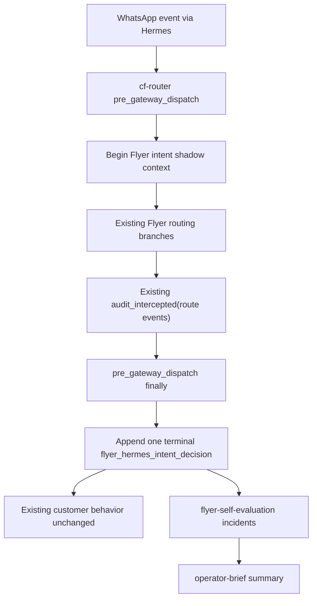

# Flyer Hermes Intent Layer Design

**Drift-check tag:** `extends-Hermes`

**New primitives introduced:** `FlyerIntentDecision`, `FlyerIntentValidationResult`, `FlyerHermesIntentDecision` audit row, shadow context around cf-router Flyer intercepts, self-eval/operator-brief Hermes intent incidents.

## Design Review Folds

| Finding | Fold |
|---|---|
| First `audit_intercepted` event can be intermediate (`flyer_active_project_bypassed`) | Context accumulates `route_events[]`; `pre_gateway_dispatch` emits one terminal intent row in `finally` after the hook result is known |
| `CfRouterIntercepted.reason` is schema-drifted from live Flyer literals | Add all live Flyer audit reasons to the schema and add a static parity test extracting literal `audit_intercepted(reason="flyer_*")` values from `hooks.py` |
| Passthrough Flyer-shaped messages have no cf-router audit row | Any started context with no route event finalizes as `llm_passthrough` or `plugin_error_passthrough` |
| ContextVar could leak across early returns | `hooks.pre_gateway_dispatch` owns the context token and resets it in a strict `finally` block |
| `actual_route` is overloaded | Audit stores route sequence, terminal flag, `actual_action`, selected/prior project ids, status fields, subprocess rc, and branch return reason |
| Raw/fallback message ids may contain chat identifiers | Store `message_id_hash`, not raw `message_id` |
| Baseline classifier can become a third router | PR-1 advisory labels are derived from fixtures or actual route-family normalization only; no independent regex classifier for live decisions |
| Coverage SLO can false-green from one stale row | Self-eval coverage is keyed by recent message hash/route family and supports expected mode |
| Promotion criteria can pass on skewed/abstained samples | Future criteria require per-family sample counts, non-`none` decision coverage, validator-ok rate, and recent-window route-family coverage |

## Goal

Move Flyer Studio toward the durable split:

- Hermes is the brain for messy customer-language judgment.
- Flyer code is the contract and safety harness.

This PR implements the contract and route-trace substrate first. It does not let Hermes route live traffic yet.

## Hermes-First Analysis

| Domain | Hermes skill/tool found? | Decision |
|---|---|---|
| WhatsApp ingress and bridge delivery | Yes - existing Hermes gateway + cf-router plugin | Reuse; no new messaging substrate |
| Sender identity and media cache | Yes - `lid_to_phone_via_identify_sender`, Hermes event/media paths | Reuse; no new identity layer |
| LLM gateway / future classifier | Yes - Hermes/OpenRouter gateway | Define prompt/schema only; no live model call in PR-1 |
| Session/memory search | Yes - Hermes memory/session search | Emit audit/training evidence; memory ingestion is follow-up |
| Background tasks/Kanban/Codex | Yes - Hermes runtime features | Backlog; not needed for intent PR-1 |
| Flyer route/state/copy policy | No generic Hermes skill | Keep deterministic Flyer validator, legal route contract, and copy policy in Flyer code |

Awesome-Hermes-Agent ecosystem check: Hermes supplies orchestration and learning substrate, but no Flyer-specific intent schema/validator exists. Verdict: extend Hermes with Flyer product policy; do not build new queues, reports, or message delivery.

## Architecture



The key design choice is to observe the actual route events at the existing `actions.audit_intercepted(...)` chokepoint, then emit exactly one terminal intent row from the outer hook `finally`. This avoids creating a second router and avoids false confidence from a simplified preview or an intermediate route event.

## Runtime Modes

`FLYER_HERMES_INTENT_MODE` accepts:

- `off`: no intent context and no intent audit.
- `shadow`: default; advisory decisions and actual-route audit only.
- `low_risk_active`: parsed as `unsupported_active_mode`; live behavior remains shadow/inert.
- `active`: parsed as `unsupported_active_mode`; live behavior remains shadow/inert.
- any other value: parsed as `unsupported_active_mode`.

Unsupported active modes are visible in self-eval/operator brief. This makes an env slip loud without letting it route or mutate.

## Intent Contract

`src/agents/flyer/intent.py` is pure, deterministic, and side-effect free.

Models use Pydantic v2 with `ConfigDict(extra="forbid")`.

### `FlyerIntentDecision`

Fields:
- `schema_version: Literal[1]`
- `decision_source: Literal["none", "fixture", "deterministic_baseline", "hermes_gateway_future"]`
- `intent: Literal["new_flyer", "revise_flyer", "approve_final", "status_check", "account_update", "onboarding_answer", "source_edit", "reference_use", "sample_prompt_choice", "unclear", "unknown"]`
- `action: Literal["observe", "clarify", "route_current", "create_project", "revise_project", "approve_project", "account_update", "manual_review"]`
- `confidence: float` from 0 to 1
- `needs_clarification: bool`
- `clarifying_question: str`
- `customer_reply: str`
- `target_project_id: str`
- `reason: str`
- `evidence: list[str]`

PR-1 uses `decision_source="none"` for live traffic unless a test fixture supplies an advisory decision. It does not add an independent live regex classifier. The canonical prompt exists so the next PR can swap `decision_source="hermes_gateway_future"` behind the same contract.

### Validation

`validate_flyer_intent_decision(decision, context)` returns:
- `ok: bool`
- `reasons: tuple[str, ...]`
- `would_mutate: bool`
- `risk_scope`

Reject when:
- model has extra/invalid fields,
- mutating action confidence is below threshold,
- `customer_reply` violates `customer_copy_policy.scan_customer_text`,
- source-edit action attempts automation in PR-1,
- active-mode action is requested in an inert mode,
- target project is outside known active context when supplied.

## Shadow Context

`actions.begin_flyer_intent_shadow(...)` stores per-message context in a `contextvars.ContextVar`. `hooks.pre_gateway_dispatch` owns the token:

```python
token = actions.begin_flyer_intent_shadow(...)
try:
    ...
finally:
    actions.finalize_flyer_intent_shadow(result=hook_result, error=error)
    actions.reset_flyer_intent_shadow(token)
```

Every early return still passes through this `finally`.

Context fields:
- `mode`
- `decision`
- `validation`
- `message_id`
- `message_id_hash`
- `chat_id`
- `chat_key_hash`
- `has_media`
- `customer_status`
- `project_status`
- `intake_status`
- `selected_project_id`
- `risk_scope`
- `emitted`
- `route_events`
- `prior_active_project_id`
- `branch_return_reason`

`actions.audit_intercepted(...)` calls `record_flyer_intent_route_event(reason=..., subprocess_rc=..., detail=...)` for Flyer reasons only. This recording must be outside the typed `CfRouterIntercepted` model validation path so schema drift in old cf-router audit cannot suppress the new shadow context.

`actions.finalize_flyer_intent_shadow(...)` chooses the terminal route:
- last customer-visible route event wins,
- `flyer_active_project_bypassed` is intermediate unless it is the only event,
- no route event plus normal hook return is `llm_passthrough`,
- an exception path is `plugin_error_passthrough`.

This intent audit is best-effort and may not block routing. It emits once per message context from the outer hook boundary.

## Audit Row

`FlyerHermesIntentDecision` extends `LogEntry`.

Fields:
- `type: Literal["flyer_hermes_intent_decision"]`
- `schema_version: Literal[1]`
- `mode: Literal["off", "shadow", "unsupported_active_mode"]`
- `decision_source`
- `message_id_hash`
- `chat_key_hash`
- `has_media`
- `validator_ok`
- `validator_reasons`
- `advisory_intent`
- `advisory_action`
- `confidence`
- `would_mutate`
- `actual_route`
- `actual_reason`
- `actual_action`
- `route_sequence`
- `route_terminal`
- `subprocess_rc`
- `branch_return_reason`
- `selected_project_id`
- `prior_active_project_id`
- `project_status`
- `customer_status`
- `intake_status`
- `preview_source: Literal["actual", "simulated", "none"]`
- `live_route_changed: Literal[False]`
- `active_customer_risk`
- `risk_scope: Literal["active_project", "active_customer", "active_intake", "pre_project_customer_visible", "historical_audit", "none"]`

No raw request, phone number, customer name, provider key, or free-form customer copy is stored.

## Route Attribution

The authoritative route sequence is every Flyer `reason` passed to `audit_intercepted`, for example:
- `flyer_primary_project_created`
- `flyer_active_project_bypassed`
- `flyer_account_command`
- `flyer_reference_exact_edit_queued`
- `flyer_project_status`
- `flyer_primary_failed`

The audit row stores both:
- `route_sequence`: compact list of observed route reasons,
- `actual_route`: the terminal customer-visible route.

`actual_action` is a route-family normalization:
- `new_project`
- `revision`
- `approval`
- `status`
- `manual_review`
- `account_update`
- `onboarding_or_intake`
- `passthrough`
- `failure`
- `unknown`

Disagreement logic compares advisory intent/action to `actual_action`, not raw enum strings.

## Coverage SLO

Self-eval computes over the same decision-entry input window:
- `shadow_sample_count`: number of `flyer_hermes_intent_decision` rows.
- `flyer_cf_router_sample_count`: number of cf-router rows whose reason starts with `flyer_`.
- coverage by `message_id_hash` and `actual_action`.

If expected mode is `shadow` and recent Flyer cf-router rows exist without matching shadow rows, emit:
- `hermes_intent_shadow_coverage_missing`
- severity `high`
- active risk true for customer-visible reasons.

If expected mode is `off`, self-eval reports no coverage incident. If expected mode is omitted, self-eval treats observed unsupported active mode as important but does not red/yellow solely because no shadow rows exist. This catches broken imports, mode drift, schema append failures, and disabled shadow mode when operators expect it.

## Incidents

Self-eval adds:
- `hermes_intent_rejected_by_validator`: validator failed on a non-`none` decision source.
- `hermes_intent_live_route_disagreement`: advisory intent/action disagrees with actual route.
- `hermes_intent_would_clarify_but_router_mutated`: advisory asked clarify while current router took a customer-visible mutating route.
- `hermes_intent_shadow_coverage_missing`: Flyer cf-router traffic exists but no shadow samples.
- `hermes_intent_unsupported_active_mode`: env requested active mode, but PR-1 forced it inert.

Operator brief groups them as:

```text
Hermes intent: rejected=1; disagreements=2; clarify_vs_mutate=1; coverage_missing=0; unsupported_active_mode=0; active=...
```

## Test Strategy

TDD order:
1. Pure intent contract tests.
2. Typed audit schema tests.
3. Shadow no-behavior-change router tests.
4. Self-eval incident tests.
5. Operator brief grouping tests.
6. Static cf-router reason parity test.

Mutation guard tests spy on:
- `bridge_post`
- `bridge_send_media`
- `send_flyer_text`
- `trigger_*`
- `invoke_*`
- `atomic_write_json`
- state path writes

The only allowed shadow side effect is `audit_flyer_hermes_intent_decision`.

## Promotion Criteria For Future PR

This PR does not promote active routing. A future PR can only do that after:
- at least 50 shadow samples in each route family proposed for active mode,
- non-`none` decision coverage for that family,
- validator-ok rate above the pre-registered threshold,
- no Critical/High live-route disagreements for the chosen route family,
- replay suite covers every promoted route family,
- customer-copy validator blocks unsafe replies,
- rollback env verified,
- operator approval.

## Deferred Items

- Live Hermes classifier call through gateway.
- Memory/self-learning ingestion of accepted/rejected route examples.
- Active low-risk route for status checks only.
- Real intercept replay layer with actual WhatsApp transcript fixtures.
- Dashboard lane for Hermes intent incidents.
- Broader multilingual classifier examples.
