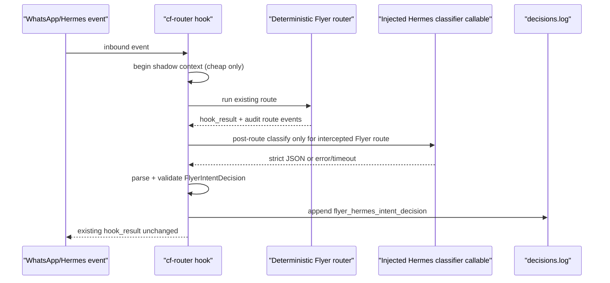
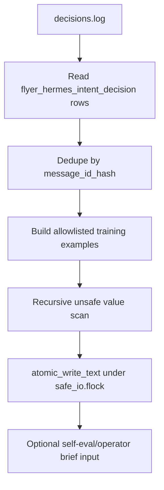

# Flyer Hermes Shadow Adapter And Training Export Design

**Drift-check tag:** extends-Hermes

**New primitives introduced:** injected Hermes classifier adapter seam, classifier status fields on `flyer_hermes_intent_decision`, redacted Flyer intent training export CLI, optional self-eval/operator-brief training-export incidents.

## Goal

Build the next two infrastructure slices after PR #171 without deploying or changing customer behavior:

1. PR-A: let Hermes produce advisory Flyer intent decisions in shadow.
2. PR-B: export redacted self-learning/training examples from those decisions and actual route outcomes.

This is still not active routing. The customer-visible router remains deterministic cf-router until a later soak-gated PR.

## Hermes-First Analysis

| Domain | Hermes skill found? | Decision |
|---|---|---|
| WhatsApp ingress / sender identity / bridge delivery | yes - current Hermes gateway + cf-router plugin | Reuse; no new message substrate |
| Intent classification | yes - Hermes gateway/LLM substrate; no Flyer-specific skill found in Hermes Skills Hub | Use injected gateway callable; no direct provider client |
| Structured contract validation | none found for Flyer Studio | Keep deterministic Flyer schema/validator |
| Memory/session learning | yes - Hermes persistent memory and session search; external memory providers exist | Export redacted examples for operator/Hermes ingestion; no automatic production memory write |
| Self-evolution loop | yes - Hermes Self-Evolution Kit exists | Feed offline/staging examples; no production code/SKILL/prompt mutation |
| Operator observability | repo-local self-eval/operator brief already exist | Extend existing tools; no parallel dashboard/substrate |

Awesome-Hermes-Agent ecosystem check: Hermes ecosystem provides skills, memory, providers, and self-evolution tooling, but no Flyer-specific routing contract or outcome training schema. Verdict: Hermes owns classification and learning substrate; Flyer owns product labels, validator, redaction, and route-outcome mapping.

## Design Principles

- **Post-route shadow:** capture cheap context before routing, but run the classifier after deterministic routing returns. A slow classifier must not delay the initial customer acknowledgement.
- **No provider client:** the adapter consumes a callable supplied by Hermes/plugin context. `intent.py` and cf-router glue must not import OpenAI/OpenRouter/urllib/requests or read model/provider keys.
- **One router:** advisory Hermes output is compared to `actual_action`; it never selects the live branch.
- **One audit row:** use the existing `flyer_hermes_intent_decision` row. Add bounded classifier status fields rather than adding a second error row.
- **Allowlist export:** memory/training examples copy only explicit PII-light fields. They never copy raw project/customer dicts.
- **Self-learning boundary:** production may write reports/artifacts only. Prompt, SKILL, model, routing, and code changes require tests, review, PR, and deploy.

## Design Review Folds

| Finding | Fold |
|---|---|
| Deployed import path can silently disable shadow | PR-A must install/package-import `agents.flyer.intent` and `agents.flyer.customer_copy_policy` or provide a flat fallback, then smoke the exact deployed import path. Import failure becomes `classifier_status="error"` or a smoke failure, not silent success. |
| Gateway callable is not threaded through hook | `hooks.pre_gateway_dispatch()` passes `gateway` into `actions.finalize_flyer_intent_shadow(..., gateway=gateway)`. `actions` extracts a classifier callable through one explicit helper. Absent callable records `skipped_no_gateway`. |
| Post-route finalization still blocks passthrough LLM messages | Synchronous classifier calls are scoped to already-intercepted Flyer routes only. Passthrough candidate messages record `skipped_passthrough`/`skipped_no_route` and do not call the classifier before generic LLM routing. Future background mode can expand coverage. |
| Deploy/smoke checks too weak | Add installed-code smoke that imports hooks/actions plus `agents.flyer.intent`, executes begin -> record route -> finalize, and validates the emitted row through `schemas.LogEntry`. |
| Decision source and classifier status semantics could conflict | Define exact combinations: `classifier_status="success"` requires `decision_source="hermes_gateway_future"`; skipped/error/timeout/invalid use `decision_source="none"` unless a parseable but invalid payload supplied a source. Self-eval reasons from `classifier_status`. |
| Current `build_training_example()` dumps unsafe nested decision fields | PR-B export must use a flattened allowlisted DTO. Do not reuse `decision.model_dump()` wholesale. |
| Training examples lack safe input signal | Add tokenless `input_features` categories derived before export. |
| Outcome label is underspecified | Split route label from business outcome label and define evidence/precedence. |
| Dedupe by message hash alone is brittle | Dedupe by `(schema_version, chat_key_hash, message_id_hash)` and flag weak/empty hashes. |
| "Memory ingestion" overclaims | Rename PR-B runtime artifact to "training export"; reserve "Hermes ingestion" for a later import receipt with checksum/count/destination. |

## PR-A Runtime Flow



### Adapter Boundary

`src/agents/flyer/intent.py` exposes pure parsing/validation functions:

- `classifier_setting_from_env(value) -> "off" | "shadow"`
- `parse_classifier_payload(payload) -> FlyerIntentDecision`
- `build_classifier_request(...) -> FlyerClassifierRequest`
- `run_classifier_shadow(callable, request, timeout_ms) -> FlyerClassifierResult`

The callable signature is:

```python
Callable[[FlyerClassifierRequest], str | dict[str, Any]]
```

The callable may be backed by Hermes gateway in production, or monkeypatched in tests. If the hook cannot supply a callable, the classifier status is `skipped_no_gateway`.

The concrete threading path is:

```python
result = _pre_gateway_dispatch_impl(...)
actions.finalize_flyer_intent_shadow(
    hook_result=result,
    error=error,
    gateway=gateway,
)
```

`actions._flyer_classifier_callable_from_gateway(gateway)` is the only production extraction point. It may look for a future stable Hermes classifier method, but it must not import providers or construct a model client. If the method is absent, the row records `skipped_no_gateway`.

### Classifier Status

Extend `FlyerHermesIntentDecision` with:

- `classifier_status: Literal["off", "skipped_not_candidate", "skipped_no_gateway", "skipped_budget", "success", "timeout", "invalid", "error"]`
- `classifier_error_kind: str`
- `classifier_error_detail: str`
- `classifier_latency_ms: int`

All error detail is bounded and redacted. `decision_source="none"` is no longer overloaded; status tells whether no classifier was intended, skipped, or failed.

Exact source/status rules:

| classifier_status | decision_source | Meaning |
|---|---|---|
| `off` | `none` | classifier explicitly disabled |
| `skipped_not_candidate` | `none` | not a Flyer candidate |
| `skipped_passthrough` | `none` | candidate fell through to generic LLM; avoid blocking passthrough |
| `skipped_no_gateway` | `none` | no injected Hermes callable available |
| `skipped_budget` | `none` | no remaining hard budget |
| `timeout` | `none` | callable exceeded timeout/budget |
| `invalid` | `none` | callable returned unparsable or schema-invalid payload |
| `error` | `none` | callable raised or import/extraction failed |
| `success` | `hermes_gateway_future` | callable returned valid strict decision |

### Latency Safety

The classifier runs after routing and only when the route was intercepted by cf-router as Flyer work. Passthrough candidate messages do not call the classifier synchronously because that would delay the generic LLM path.

It still has a hard budget so finalization does not create long plugin tail latency:

- default budget: 250 ms
- timeout/error recorded in the audit row
- route result already computed and returned unchanged
- tests use a slow fake callable to prove route/customer sends are invariant
- tests assert passthrough candidates do not call the classifier synchronously

## Deployed Import And Smoke

PR-A must close the install gap that can otherwise make shadow rows silently disappear.

Required deploy/smoke behavior:

- install or preserve package-compatible imports for `agents.flyer.intent` and `agents.flyer.customer_copy_policy`;
- keep local tests and deployed cf-router imports on the same path where possible;
- add flat fallback only if package install is not viable, and test both paths;
- pre-restart smoke imports `hooks.py`, `actions.py`, and `agents.flyer.intent`;
- installed-code smoke monkeypatches `LOG_PATH`, calls `begin_flyer_intent_shadow -> record_flyer_intent_route_event -> finalize_flyer_intent_shadow`, and validates the resulting row with `schemas.LogEntry`.

## PR-B Training Export Flow



### Training Example Shape

Do not serialize `FlyerIntentDecision.model_dump()` wholesale. PR #171's `build_training_example()` is too broad for export because it includes free-form reply/reason/evidence fields. PR-B should either narrow that helper or create a flattened allowlisted DTO.

Allowed training fields:

- `schema_version`
- `message_id_hash`
- `chat_key_hash`
- advisory intent/action/confidence only
- validator ok/reasons/would_mutate
- `actual_action`
- `actual_route`
- `route_sequence`
- `classifier_status`
- `agreement: bool`
- `route_label`, derived from the terminal route
- `outcome_label`, one of `delivered`, `manual_review`, `failed`, `in_progress`, `unknown`
- `outcome_evidence_source`
- `outcome_observed_at`
- `input_features`

Forbidden from export:

- `customer_reply`
- `clarifying_question`
- `target_project_id`
- free-form `reason`
- free-form `evidence`
- raw request text
- raw project/customer dictionaries

No raw text, phone, chat id, customer name, address, media path, URL, or provider/model key is allowed.

### Input Features

`input_features` is categorical and tokenless. It may include:

- `has_media`
- `risk_scope`
- `customer_status_bucket`
- `project_status_bucket`
- `message_shape`: `short`, `medium`, `long`, `media_only`
- `mentions_flyer`
- `mentions_approve`
- `mentions_status`
- `mentions_account_update`
- `mentions_source_edit`
- `mentions_reference`
- `mentions_price_or_schedule`

These features are derived with deterministic booleans and buckets; they do not preserve user substrings.

### Outcome Joiner

Route outcome and business outcome are separate.

Precedence for `outcome_label`:

1. `FlyerAssetsDelivered` audit for the selected/hashed project scope -> `delivered`.
2. Current project state `manual_edit_required` or route family `manual_review` -> `manual_review`.
3. `flyer_primary_failed`, `flyer_delivery_failed`, final QA failure, or subprocess nonzero -> `failed`.
4. Active project states such as generating/revising/finalizing/awaiting approval -> `in_progress`.
5. Otherwise -> `unknown`.

The export records `outcome_evidence_source` and `outcome_observed_at`. A successful `new_project` route is not treated as delivered.

### Redaction

Use allowlist first, recursive unsafe-value scan second.

Reject the example if any value matches:

- E.164/US phone numbers
- WhatsApp JIDs or LIDs
- likely street addresses
- local absolute paths
- URLs
- API key/token patterns
- raw request echoes supplied in fixtures

## Self-Eval And Operator Brief

PR-A adds classifier status awareness:

- `hermes_intent_classifier_timeout`
- `hermes_intent_classifier_invalid`
- `hermes_intent_classifier_error`
- existing disagreement/rejection incidents remain

PR-B adds optional expectation:

- CLI flag: `--expect-flyer-intent-training-export`
- optional artifact input: `--flyer-intent-training-json`

Incidents:

- `flyer_intent_training_export_missing`
- `flyer_intent_training_export_stale`
- `flyer_intent_training_export_redaction_failed`

These are only emitted when training export is expected, so normal local report use is not noisy.

Actual Hermes memory ingestion is a later step and requires an ingestion receipt with artifact checksum, exported example count, destination/store id, and `ingested_at`.

## Deployment Posture

No deploy for either PR.

If merged later:

- PR-A can deploy shadow-only after route-invariance tests and smoke import pass.
- PR-B can deploy as offline CLI/reporting. It still does not write Hermes memory automatically.

## Future Active Routing Gate

A future active-routing PR needs deployed shadow evidence:

- at least 25 total classifier fires and route-family minimums;
- classifier success rate at least 95%;
- zero route mutation and zero customer-send delta;
- p95 classifier finalization latency under 250 ms or proven non-blocking background execution;
- validator rejection below 10%;
- zero accepted customer-copy policy violations;
- source-edit automation still rejected unless separate smoke approves it;
- self-eval with `--expected-hermes-intent-mode shadow --expect-flyer-intent-training-export` has no active high/critical Hermes incidents.

## Test Strategy

PR-A:

- strict payload parsing;
- invalid/timeout/error statuses;
- banned-copy rejection;
- no-provider static guard;
- route-invariance tests with conflicting Hermes decisions;
- deploy/smoke import path tests.

PR-B:

- decision row -> training example;
- dedupe/window filters;
- explicit allowlist;
- recursive unsafe-value rejection;
- safe_io write lock/atomic write;
- self-eval/operator brief missing/stale/redaction incidents.

## Risks

- Hermes gateway callable API may not be available in cf-router context. Mitigation: adapter seam is injectable; absent gateway is explicitly `skipped_no_gateway`, not a silent success.
- Too much classifier latency. Mitigation: post-route only, hard budget, audit status, soak gate.
- Training examples too sanitized to be useful. Mitigation: preserve route/action/validator/outcome labels while excluding PII.
- Operator misreads shadow as active. Mitigation: audit rows keep `live_route_changed=false`; PR body and self-eval state no active route exists.
